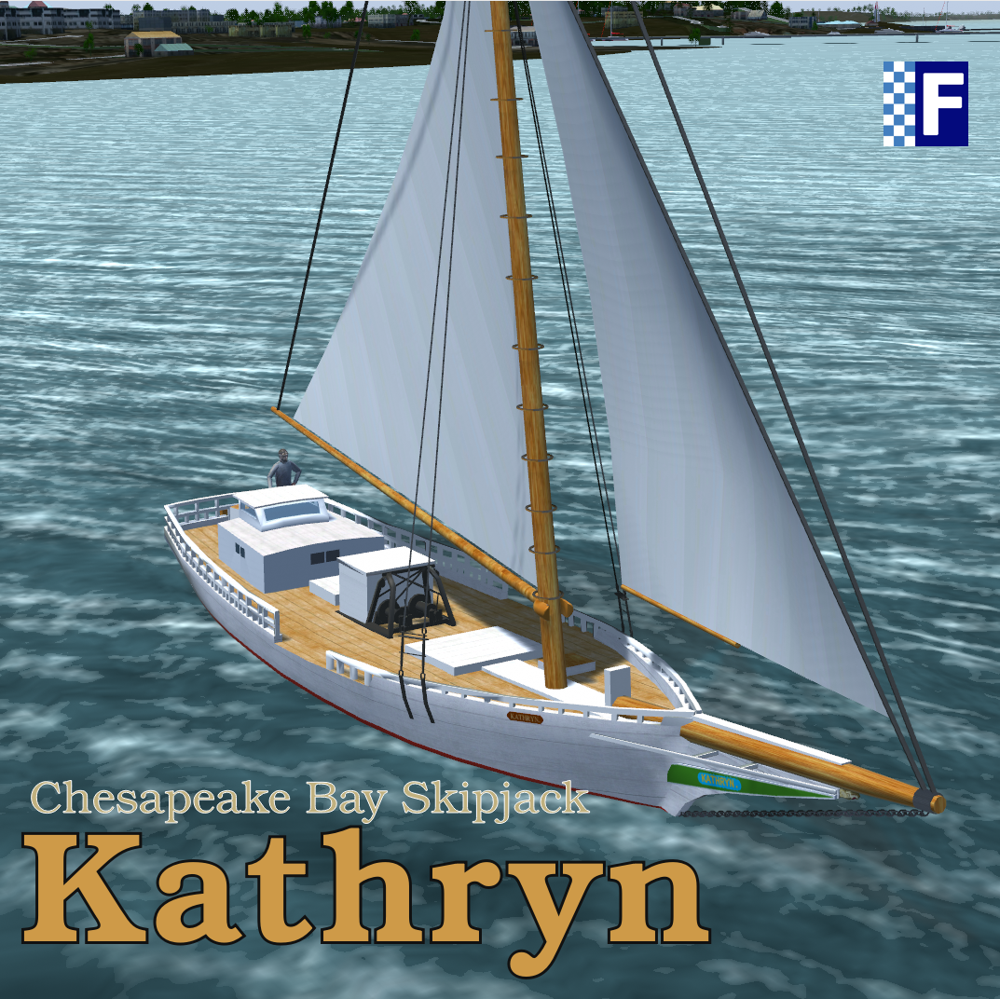

# Kathryn

This is an attempt to recreate the Chesapeake Bay Skipjack *Kathryn* in FlightGear.

## Current State

This project is another sandbox for me to learn the ins-and-outs of Flightgear development and play in the virtual water. Don't expect a professional level experience! This first release is based on Anders Gidenstam's *Gokstad* Viking ship for FlightGear. This is my first attempt at a multi-sail vessel. As always, my projects are WIPs (works in progress)! There is much to do in the areas of hydrodynamics and sail performance.

To install the *Kathryn* simply unzip the files into your FGFS aircraft directory. Rename the uncompressed folder by removing the '-main' from the folder name. E.g., the folder should be named 'Kathryn' not 'Kathryn-main'. Remember to start in the water. Starting FlightGear with parameters:

`--lat=38.98664614201565 --lon=-76.48263438612488 --heading=90`

will place you in the Chesapeake Bay just off-shore the US Naval Academy in Annapolis, Maryland, USA. Remember to view the help file by pressing '?' to learn how to control the sails.

## History

The *Kathryn* is one of just a few remaining Chesapeake Bay Skipjacks. This uniquely American type of work boat developed in the waning years of the 19th century specifically for the role of harvesting oysters in the Chesapeake Bay. The builder of the *Kathryn* remains anonymous but she was first registered in 1901. All in all, there have probably been less than 3,000 Skipjacks ever built.

To this day Skipjacks are legally prohibited from harvesting oysters under power. Consequently, they are propelled by small push-boats to and from their worksites where they operate under sail while harvesting. Meanwhile, they act as excursion boats in the off-season.

